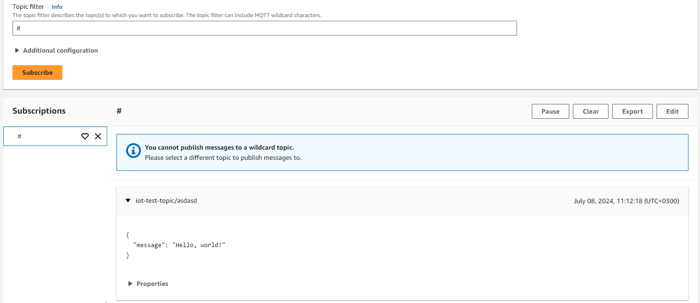

# aws-iot-core-pipeline WIP

# Summary

The goal is to make explore AWS iot-core and Kinesis Firehose services. 

The preliminary pipeline plan is the following:
1. Receiver would be AWS iotcore, client authentication with certificate, data received via MQTT
2. Kinesis Firehose aggregates the messages for example to 1 minute batches. The raw data would also need to be stored in a s3
3. Lambda handles the aggregated batches and stores the parsed data to a s3 bucket.

The directory "iot-core-pipeline" will have all the stack related files and code while the directory "Various" will have some testing scripts etc.

# Prerequisites

1. AWS Account
2. AWS CLI https://docs.aws.amazon.com/cli/latest/userguide/getting-started-install.html
3. AWS CLI configured with an IAM role with generous priviledges.
4. AWS SAM https://docs.aws.amazon.com/serverless-application-model/latest/developerguide/install-sam-cli.html

# Getting started

1. Create an empty directory
2. Run ```sam init``` in the directory. Follow the steps, this will create alot of boilerplate resources. I added most of these to .gitignore to not clutter this repo so that the meaningfull content can be found more easily.
3. Run ```sam build```. NOTE: SAM will create a new directory.
4. Quick and dirty, run ```sam deploy --guided```. This is a guided deployment. In the future I will add a deployment script.

# IoT thing setup

Handling certificates in the CloudFormation template seems to be a real pain, and you still need to do some manual work outside of the template. This is why I opted to do some Click-Ops for the certificate part. 

Also it maybe would be best if the certificates are created outside of the CF-template, since if we need to for example create new ones, we would need to modify the template. In this case I think Click-Ops would be the way to go.

## CF setup

In the CF-Template I first defined the thing to be created as follows

```
  IoTThing:
    Type: AWS::IoT::Thing
    DeletionPolicy: Delete
    UpdateReplacePolicy: Delete
    Properties:
         ThingName: !Sub '${Environment}-iot-thing-321'
```
I wanted to delete the thing if I delete the stack. Thats why it has the delete and update policies.

Then I defined a IAM-policy that allows to connect and publish to the specified topic and all topics under it. If you would for example have multiple customers use the same thing, then I would most likely for example create topic specific policies + multiple certs. 

```
IoTPolicy:
    Type: AWS::IoT::Policy
    Properties:
         PolicyName: 'IotPolicy'
         PolicyDocument:
              Version: '2012-10-17'
              Statement:
                - Effect: 'Allow'
                  Action:
                    - 'iot:Connect'
                    - 'iot:Publish'
                  Resource: 
                    - !Sub 'arn:aws:iot:${AWS::Region}:${AWS::AccountId}:client/${Environment}-iot-thing-321'
                      # Allow publishing to a specific topic.
                    - !Sub 'arn:aws:iot:${AWS::Region}:${AWS::AccountId}:topic/${IotTopicName}'
                      # Allow publishing to any sub-topics under the specific topic.
                    - !Sub 'arn:aws:iot:${AWS::Region}:${AWS::AccountId}:topic/${IotTopicName}/*'
```
Now when the stack is deployed, we will have the thing and the IAM-policy, these both are needed for the certificate config.

## Certificate setup from console

1. Navigate to IoT-core in the AWS Console
2. From the Left navigation bar go to All Devices --> Things
3. Choose the created thing.
4. Choose Certificates and Click "Create certificate"
5. Download all the stuff, store it securely.
6. Click the created certificate
7. You will see that it has no policies attached, attach the created policy to it.
8. Remember to activate it.

## Testing the Thing

1. I created a simple publisher notebook, which can be found under the directory "Various"
2. Fill in the required parameters. NOTE: The client-id needs to match the thing name + the topic has to be one that the IAM-policy allows the publishing. The endpoint cant be found from under the "Settings" in the AWS IoT Core.
3. Go to AWS IoT Core and subscribe to the topic with MQTT-test client.
4. Send messages with the notebook.
5. View the messages:



### Messages wont appear what to do

Review all the variables in the sending script, if the script does not give you any errors do the following:

1. From the left navigation bar go to "Thing" and choose the thing.
2. Click "Activity" and try to send a message.
3. Check that the activities show a connected event, this is good and it means we can connect okay.
4. If you get a immidiate disconnect due to "CLIENT ERROR" it most likely is due that the IAM-policy does not have the required priviledges to publish to the topic you are trying to send.
5. Review the topic that you are tring to send messages and use the wildcard '#' in the test client.

If you cannot connect check that the certificate is active and it is attached to the IAM-policy.
